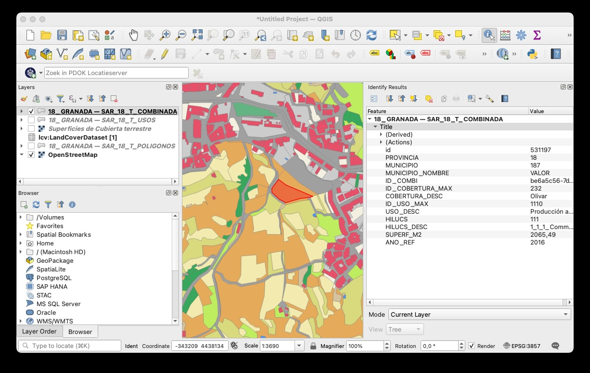
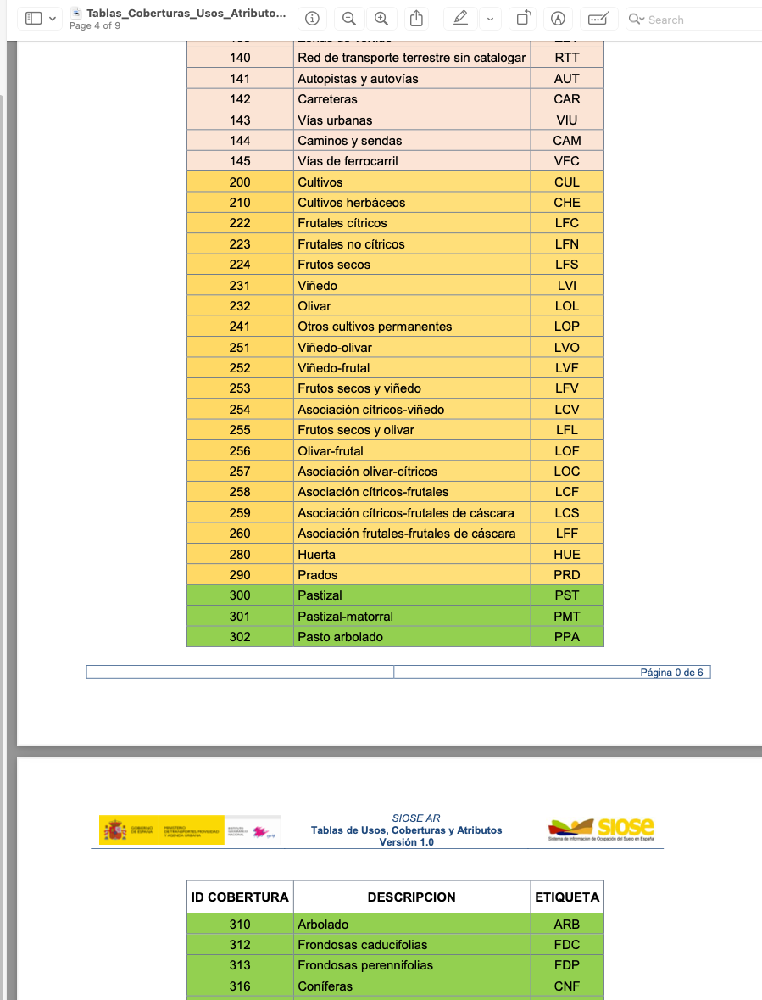
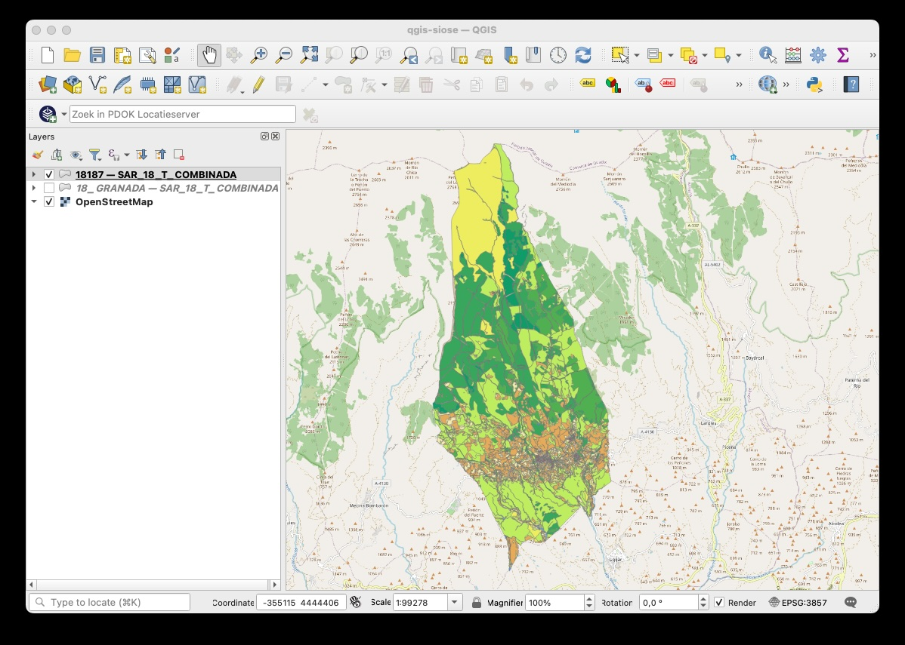
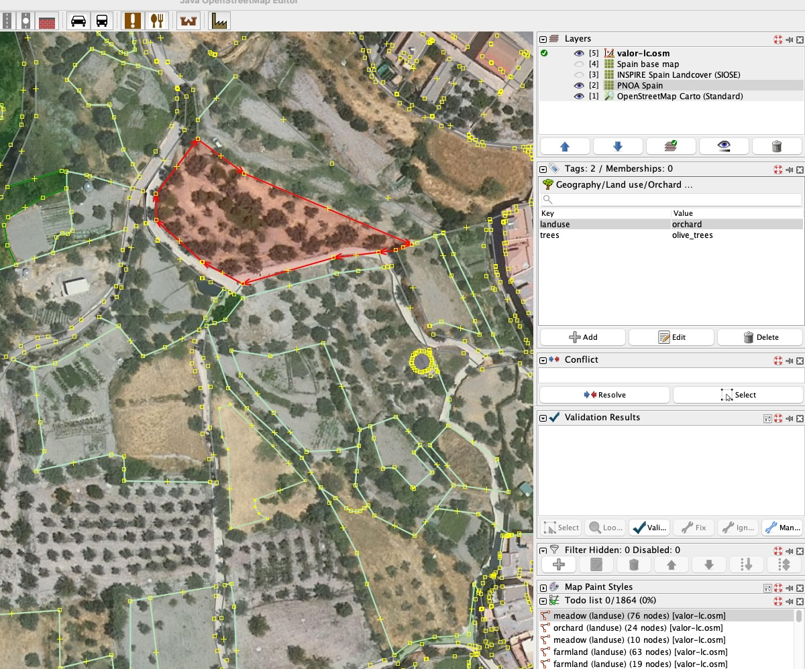

# PoC - Workflow importing SIOSE Landcover in OSM

This is a PoC (Proof of Concept) to test the feasiblity to establish a basic workflow for import of Spain's Landcover dataset , "SIOSE AR" (Alto Reso, hi-res, scale 1:1000-1:5000m) from SIOSE into OpenStreetMap. 

*NB this process is not yet executed, need discussion and refinement with the OSM-ES Community, SIOSE (for licensing waiver) and OSM DWG for import permission.*

## Source data (GPKG per province)

Link for Granada: https://centrodedescargas.cnig.es/CentroDescargas/detalleArchivo?sec=11599572#

```
Landuse and LandCover SIOSE
SIOSE AR (Alto Resolucion)
Producto: SIOSE AR
Fichero: SAR2017_18_GRANADA_GPKG.ZIP
Fecha: 2016
Escala: 1000 a 5000
Tamaño: 2308.95 (Mb)
Formato: GeoPackage
Sistema de Referencia Geodésico: ETRS89 en la Península
```

## Open GeoPackage for Municipality in QGIS and Download Layer



Layers: 

* `18_GRANADA — SAR_18_T_COMBINADA` - this combines Landcover Polygons, our Source Layer!
* `18_GRANADA — SAR_18_T_POLIGONOS` has boundaries on Parcels, more polygons
* `18_GRANADA — SAR_18_T_USOS` is less useful (Landuse).

Download a Canvas area into a GPKG for `18_GRANADA — SAR_18_T_COMBINADA`, reproject to EPSG:4326 (WGS84).
TODO: could be done woth `ogr2ogr`.
Filename: `polygonos-greater-valor.gpkg` 

## Documentation

* https://www.siose.es/documentacion
* https://www.siose.es/SIOSEtheme-theme/documentos/pdf/Tablas_Coberturas_Usos_Atributos.pdf
* https://www.siose.es/en/web/guest/especificaciones-tecnicas-ar

Excerpt:



## Use ogr2ogr to extract single Municipality

An `extract.sh` script can extract a single municipality from a province GeoPackage together with styles.
This provides more automation, as QGIS is not required. We use here for inspection. The municipality of Válor (18187) in Province Granada (18).

`./extract.sh 18_GRANADA.gpkg 18187`

This results in the GPKG file `18187.gpkg` with a single Layer `SAR_18_T_COMBINADA` which can be viewed with styles in QGIS.



## Make a CSV mapping file with OSM tags for ID_COBERTURA_MAX

```
src_ID_COBERTURA_MAX;COBERTURA_DESC_ES;COBERTURA_DESC_EN;osm_landuse;osm_natural;osm_landcover;osm_trees;osm_leaf_type;osm_leaf_cycle;osm_meadow
101;Edificación;Buildings;;;;;;;
102;Zona verde artificial y arbolado urbano;Artificial green areas and urban trees;;;;;;;
104;Zonas pavimentadas o selladas;Paved or sealed areas;;;;;;;
105;Piscina;Swimming pool;;;;;;;
.
.
232;Olivar;Olive grove;orchard;;;olive_trees;;;
241;Otros cultivos permanentes;Other permanent crops;farmland;;;;;;
251;Viñedo-olivar;Vineyard-olive grove;orchard;;;;;;
252;Viñedo-frutal;Vineyard-fruit tree;orchard;;;;;;
253;Frutos secos y viñedo;Nuts and vineyard;orchard;;;;;;
254;Asociación cítricos-viñedo;Citrus-vineyard association;orchard;;;;;;
255;Frutos secos y olivar;Nuts and olive grove;orchard;;;;;;
256;Olivar-frutal;Olive grove-fruit tree;orchard;;;;;;
257;Asociación olivar-cítricos;Olive grove-citrus tree association;orchard;;;;;;
258;Asociación cítricos-frutales;Citrus-fruit tree association;orchard;;;;;;
259;Asociación cítricos-frutales de cáscara;Citrus-nut tree association;orchard;;;;;;
260;Asociación frutales-frutales de cáscara;Fruit tree-nut tree association Shell;orchard;;;;;;
280;Huerta;Orchard;orchard;;;;;;
290;Prados;Meadows;meadow;;;;;;pasture
300;Pastizal;Grassland;meadow;;;;;;
301;Pastizal-matorral;Grassland-scrubland;meadow;;;;;;
302;Pasto arbolado;Wooded pasture;;wood;trees;;;;
310;Arbolado;Trees;;wood;trees;;;;
312;Frondosas caducifolias;Deciduous broadleaved;;wood;trees;;broadleaved;deciduous;
313;Frondosas perennifolias;Evergreen broadleaved;;wood;trees;;broadleaved;evergreen;
316;Coníferas;Conifers;;wood;trees;;needleleaved;;
320;Matorral;Scrubland;;scrub;scrub;;;;
```

etc

## Create a generic CSV-based Translator for ogr2osm

[ogr2osm](https://github.com/roelderickx/ogr2osm) allows for "Translators", custom Python plugins that can be provided at execution time. I attempt to make a generic translator plugin that reads a mapping CSV file with column-naming conventions to steer mapping to OSM-tags. BTW [ogr2osm](https://wiki.openstreetmap.org/wiki/Ogr2osm) was created originally by [Iván Sánchez Ortega](https://ivan.sanchezortega.es/).

- input csv mapping.csv
- must have a column 'src_' prepended to unique source attr name, e.g. src_ID_COBERTURA_MAX
- must have one or more 'osm_' column names denoting OSM-tags, may be empty

```
Example
src_ID_COBERTURA_MAX;COBERTURA_DESC_ES;COBERTURA_DESC_EN;osm_landuse;osm_natural;osm_landcover;osm_trees;osm_leaf_type;osm_leaf_cycle;osm_meadow
101;Edificación;Buildings;;;;;;;
.
300;Pastizal;Grassland;meadow;;;;;;
301;Pastizal-matorral;Grassland-scrubland;meadow;;;;;;
302;Pasto arbolado;Wooded pasture;;wood;trees;;;;
310;Arbolado;Trees;;wood;trees;;;;
312;Frondosas caducifolias;Deciduous broadleaved;;wood;trees;;broadleaved;deciduous;
313;Frondosas perennifolias;Evergreen broadleaved;;wood;trees;;broadleaved;evergreen;
```

The `mapping.py` class `CSVMappingTranslation` will create an inner lookup `dict` of `dicts` with `src_ID_COBERTURA_MAX` as
key. The value is the set of OSM-tags (stripped of `osm_` prefixes.

Code snippet:

```python
class CSVMappingTranslation(ogr2osm.TranslationBase):

    def __init__(self):

        # Read CSV (adjust delimiter as needed)
        with open("mapping.csv", newline="", encoding="utf-8") as f:
            reader = csv.DictReader(f, delimiter=";")
            rows = list(reader)

        # Find the column whose name starts with 'src_'
        src_col = next(col for col in rows[0] if col.startswith("src_"))

        # Chop-off src_
        self.src_attr = src_col[len("src_"):]

        # Find all 'osm_' columns
        osm_cols = [col for col in rows[0] if col.startswith("osm_")]

        # Build dictionary of dictionaries, stripping "osm_" prefix
        self.lookup_dict = {}
        for row in rows:
            key = row[src_col]
            inner_dict = {
                col[len("osm_"):]: (row[col] if row[col] != "" else None)
                for col in osm_cols
            }
            self.lookup_dict[key] = inner_dict

    def filter_tags(self, attrs):
        if not attrs:
            return

        tags = {}

        if self.src_attr in attrs:
            tags = self.lookup_dict[attrs[self.src_attr]]
            # Add original source id value that is mapped
            tags['ref:src_id'] = attrs[self.src_attr]

        return tags

```
## ogr2osm with Docker

```
docker run -ti --rm -w "/app" -v $(pwd):/app roelderickx/ogr2osm -t mapping.py --force --suppress-empty-tags /app/polygonos-greater-valor.gpkg -o /app/valor-lc.osm
```

## Resulting .osm file

Shared Nodes, polygons with Node refs.

```
<way visible="true" id="-65924"><nd ref="-18093"/><nd ref="-25858"/><nd ref="-65682"/>.../><tag k="landuse" v="orchard"/><tag k="ref:src_id" v="223"/></way>
<way visible="true" id="-65725"><nd ref="-65248"/>...<nd ref="-65248"/><tag k="natural" v="wood"/><tag k="landcover" v="trees"/><tag k="leaf_type" v="broadleaved"/><tag k="leaf_cycle" v="deciduous"/><tag k="ref:src_id" v="312"/></way>

```

## Load .osm in JOSM

Useful baselayers:

* wms_endpoint:https://servicios.idee.es/wms-inspire/ocupacion-suelo?SERVICE=WMS&VERSION=1.3.0&REQUEST=GetCapabilities
* PNOA (Aerial Imagery Spain)

Result in JOSM (note that we select the same polygon as in the QGIS screenshot above!):


