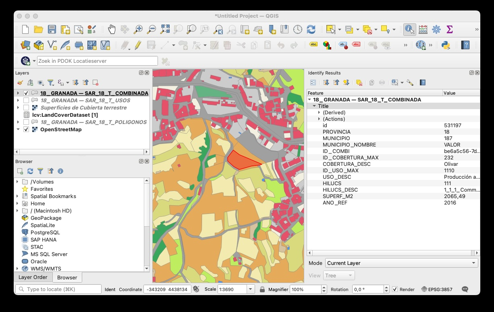
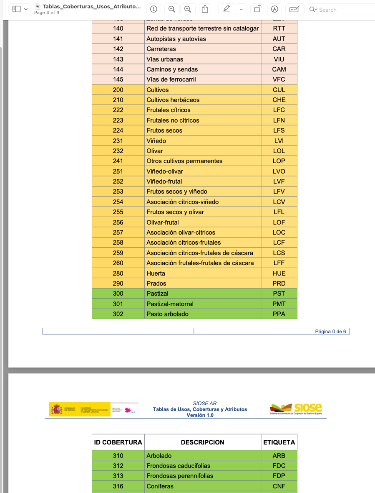
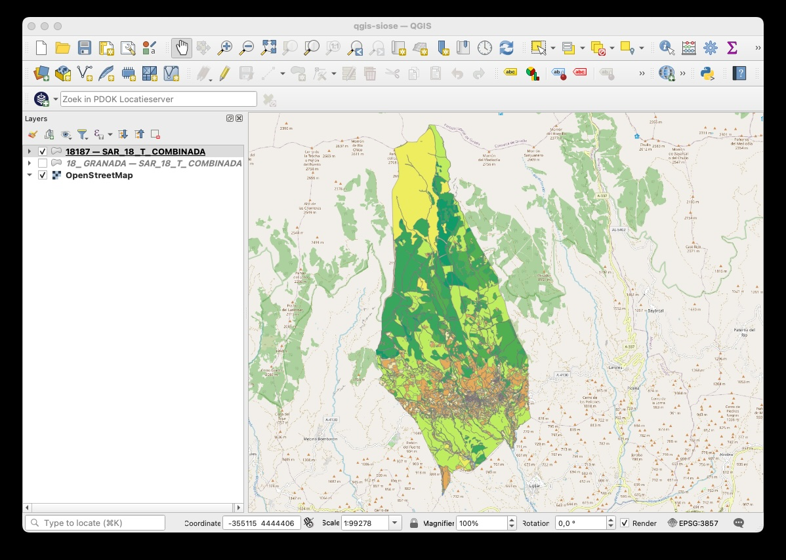
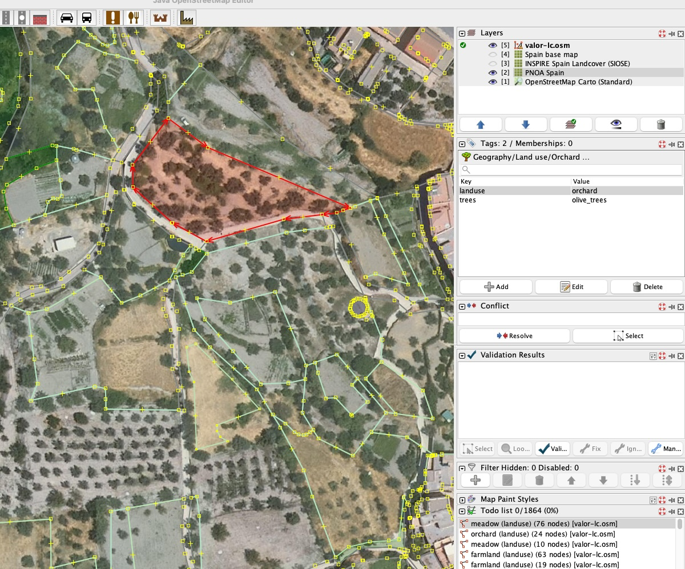

# PoC - Workflow importing SIOSE Landcover in OSM

This is a PoC (Proof of Concept) to test the feasiblity to establish a basic workflow for import of Spain's Landcover dataset , "SIOSE AR" (Alto Reso, hi-res, scale 1:1000-1:5000m) from SIOSE into OpenStreetMap. 
The outcome and content of this repository is basically a toolchain `SIOSE2OSM` that takes raw SIOSE data and extracts, translates to per-municipality OSM-files (`.osm`) to be opened in JOSM.

*NB this process is not yet executed, need discussion and refinement with the OSM-ES Community, SIOSE (for licensing waiver) and OSM DWG for import permission.*

## Source data (GPKG per province)

Link for Granada: https://centrodedescargas.cnig.es/CentroDescargas/detalleArchivo?sec=11599572#

```
Landuse and LandCover SIOSE
SIOSE AR (Alto Resolucion)
Producto: SIOSE AR
Fichero: SAR2017_18_GRANADA_GPKG.ZIP
Fecha: 2016
Escala: 1000 a 5000
Tamaño: 2308.95 (Mb)
Formato: GeoPackage
Sistema de Referencia Geodésico: ETRS89 en la Península
```

Download into the `siose2osm/data` directory and unzip.
Move the file `18_GRANADA.gpkg` to `siose2osm/data` and remove .zip and other content.
The `siose2osm/data` dir is where we work in. This is also ignored by git.

## Open GeoPackage for Municipality in QGIS and Download Layer



Layers: 

* `18_GRANADA — SAR_18_T_COMBINADA` - this combines Landcover Polygons, our Source Layer!
* `18_GRANADA — SAR_18_T_POLIGONOS` has boundaries on Parcels, more polygons
* `18_GRANADA — SAR_18_T_USOS` is less useful (Landuse).

Download a Canvas area into a GPKG for `18_GRANADA — SAR_18_T_COMBINADA`, reproject to EPSG:4326 (WGS84).
BUT NOW DONE WITH DONE WITH `ogr2ogr` with [extract.sh](siose2osm/extract.sh) Bash script (see next)!
But you can still download an area in QGIS.

## Documentation

* https://www.siose.es/documentacion
* https://www.siose.es/SIOSEtheme-theme/documentos/pdf/Tablas_Coberturas_Usos_Atributos.pdf
* https://www.siose.es/en/web/guest/especificaciones-tecnicas-ar

Excerpt:



## Use ogr2ogr to extract single Municipality

An [extract.sh](siose2osm/extract.sh) script can extract a single municipality from a province GeoPackage together with styles.
This provides more automation, as QGIS is not required. We use here for inspection. The municipality of Válor (18187) in Province Granada (18).

`./extract.sh data/18_GRANADA.gpkg 18187`

This results in the GPKG file `data/18187.gpkg` with a single Layer `SAR_18_T_COMBINADA` which can be viewed with styles in QGIS.



## Make a CSV mapping file with OSM tags for ID_COBERTURA_MAX

See [mapping.csv](siose2osm/mapping.csv).

Conventions in file:
* `src_*` denotes the source key for mapping, here `src_ID_COBERTURA_MAX` denotes the `ID_COBERTURA_MAX` Landcover SIOSE value
* `osm_*` denotes OSM tags to be assigned for `ID_COBERTURA_MAX`
* `osm_skip` has special meaning: skip any entry with that `ID_COBERTURA_MAX`

For now we only take mostly "natural" terrain values:

* no road and transport areas
* no water features
* no human-made constructions: houses and other
* no "Zona abierta" i.e. "Open areas"

Note that `natural` and `landcover` when in use, are both assigned.

```
src_ID_COBERTURA_MAX,COBERTURA_DESC_ES,COBERTURA_DESC_EN,osm_skip,osm_source,osm_landuse,osm_natural,osm_landcover,osm_leisure,osm_trees,osm_leaf_type,osm_leaf_cycle,osm_meadow,osm_water,osm_wetland
101,Edificación,Buildings,X,SIOSE,,,,,,,,,,
102,Zona verde artificial y arbolado urbano,Artificial green areas and urban trees,,SIOSE,village_green,,,,,,,,,
.
.
200,Cultivos,Crops,,SIOSE,farmland,,,,,,,,,
210,Cultivos herbáceos,Arable crops,,SIOSE,farmland,,,,,,,,,
222,Frutales cítricos,Citrus fruit trees,,SIOSE,orchard,,,,orange_trees,,,,,
223,Frutales no cítricos,Non-citrus fruit trees,,SIOSE,orchard,,,,,,,,,
224,Frutos secos,Nuts,,SIOSE,orchard,,,,,,,,,
231,Viñedo,Vineyard,,SIOSE,vineyard,,,,,,,,,
232,Olivar,Olive grove,,SIOSE,orchard,,,,olive_trees,,,,,
241,Otros cultivos permanentes,Other permanent crops,,SIOSE,farmland,,,,,,,,,
.
.
514,Embalses,Reservoirs,X,SIOSE,,water,water,,,,,,basin,
515,Canales,Canals,X,SIOSE,,water,water,,,,,,,
522,Estuarios,Estuaries,X,SIOSE,,water,water,,,,,,,
523,Mares y océanos,Seas and oceans,X,SIOSE,,water,water,,,,,,,
999,Desconocido,Unknown,X,SIOSE,,,,,,,,,,
```

etc

## Create a generic CSV-based Translator for ogr2osm

[ogr2osm](https://github.com/roelderickx/ogr2osm) allows for "Translators", custom Python plugins that can be provided at execution time. 
I attempt to make a generic translator plugin that reads a mapping CSV file with column-naming conventions to steer mapping to OSM-tags. 
BTW [ogr2osm](https://wiki.openstreetmap.org/wiki/Ogr2osm) was created originally by [Iván Sánchez Ortega](https://ivan.sanchezortega.es/).

- input CSV [mapping.csv](siose2osm/mapping.csv) (see above)
- must have a column 'src_' prepended to unique source attr name, e.g. src_ID_COBERTURA_MAX
- must have one or more 'osm_' column names denoting OSM-tags, may be empty
- `osm_skip=X` denotes that this entry (polygon) should be skipped

In [mapping.py](siose2osm/mapping.py) the class `CSVMappingTranslation` will create an inner lookup `dict` of `dicts` with `src_ID_COBERTURA_MAX` as
key. The value is the set of OSM-tags prefixed with `osm_`.

Code snippet (see [mapping.py](siose2osm/mapping.py) for current version):

```python
class CSVMappingTranslation(ogr2osm.TranslationBase):

    def __init__(self):

        # Read CSV.
        with open("mapping.csv", newline="", encoding="utf-8") as f:
            reader = csv.DictReader(f, delimiter=",")
            rows = list(reader)

        # Find the column whose name starts with 'src_'
        src_col = next(col for col in rows[0] if col.startswith("src_"))

        # Chop-off src_
        self.src_attr = src_col[len("src_"):]

        # Find all 'osm_' columns
        osm_cols = [col for col in rows[0] if col.startswith("osm_")]

        # Build dictionary of dictionaries, stripping "osm_" prefix
        self.lookup_dict = {}
        for row in rows:
            key = row[src_col]
            inner_dict = {
                col[len("osm_"):]: (row[col] if row[col] != "" else None)
                for col in osm_cols
            }
            self.lookup_dict[key] = inner_dict

        print('CSVMappingTranslation: __init__ done')

    def filter_tags(self, attrs):
        if not attrs:
            return

        tags = {}

        if self.src_attr in attrs:
            tags = self.lookup_dict[attrs[self.src_attr]]
            if tags.get('skip') == 'X':
                # print('Skipping tags %s' % tags)
                return
            # Add original source value that is mapped
            tags['ref:src_val'] = attrs[self.src_attr]

        return tags
```

## ogr2osm with Docker

Create the `.osm` file from the municipality `.gpkg`.
Command `./ogr2osm.sh <GPKG File> <OSM File>`, for example `./ogr2osm.sh data/18187.gpkg data/18187.osm`.
Uses the [mapping.csv](siose2osm/mapping.csv) file (fixed name for now).

See [ogr2osm.sh](siose2osm/ogr2osm.sh). This script calls the [Docker Image roelderickx/ogr2osm](https://github.com/roelderickx/ogr2osm/blob/main/Dockerfile).

We call within the `git/siose2osm` directory: `./ogr2osm.sh data/18187.gpkg data/18187.osm` as the data files are under `data/`.

## Resulting .osm file

Shared Nodes, polygons with Node refs.

```
<way visible="true" id="-65924"><nd ref="-18093"/><nd ref="-25858"/><nd ref="-65682"/>.../><tag k="landuse" v="orchard"/><tag k="ref:src_id" v="223"/></way>
<way visible="true" id="-65725"><nd ref="-65248"/>...<nd ref="-65248"/><tag k="natural" v="wood"/><tag k="landcover" v="trees"/><tag k="leaf_type" v="broadleaved"/><tag k="leaf_cycle" v="deciduous"/><tag k="ref:src_id" v="312"/></way>

```

## Load .osm in JOSM

Useful baselayers:

* wms_endpoint:https://servicios.idee.es/wms-inspire/ocupacion-suelo?SERVICE=WMS&VERSION=1.3.0&REQUEST=GetCapabilities
* PNOA (Aerial Imagery Spain)
* Tip: open this file first in JOSM to have all the useful layers present: [josm-siose-starter.jos](siose2osm/josm-siose-starter.jos)

Result in JOSM (note that we select the same polygon as in the QGIS screenshot above!):


